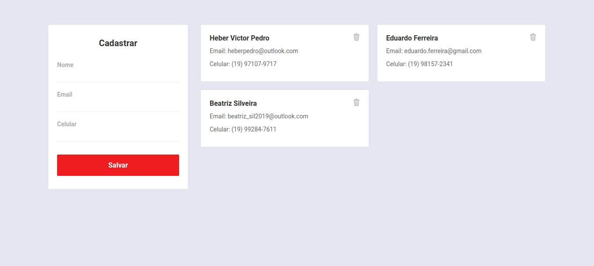
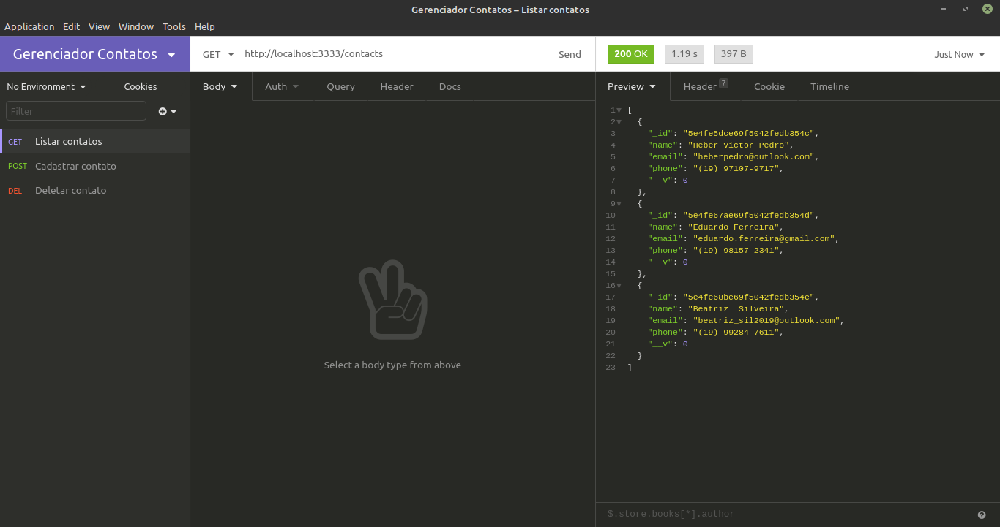

<h1 align="center">Gerenciador de Contatos</h1>

## Instalação
Configure o MongoDB e atualize a string de conexão com seu `User:Senha` no arquivo `index.js`.  
Para instalar as dependências e executar o **Servidor** (modo desenvolvimento), clone o projeto em seu computador e em seguida execute:
```bash
cd backend
yarn install
yarn dev
```
Para iniciar o **Frontend** do React utilize os comandos:
```bash
cd frontend
yarn install
yarn start
```
Assim que o processo terminar, automaticamente será aberta no seu navegador a página `localhost:3000` contendo o projeto.  

## Backend
Veja em [backend/README.md](./backend) para informações sobre o Backend e arquitetura.

## Frontend
Veja em [frontend/README.md](./frontend) para informações sobre o Frontend e os padrões. O Frontend desenvolvido ficou assim:

</img>

## Imnsonia 
Para testar a API do Gerenciador de Contatos, baixe e instale o [Insomnia](https://insomnia.rest/download/) e em seguida clique na Workspace → `Import/Export` → `Import Data` → `From File` → e selecione o arquivo ` 	Insomnia_export.json` deste repositório. Assim que terminar, o resultado ficará assim:  

</img>
